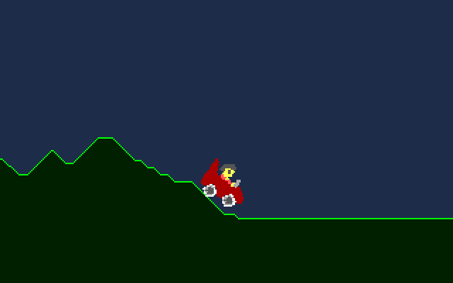

# Buggy (demo)

VGS-Xで凸凹な地面を接地しながら走る車のデモプログラムです。



## Explanation

次のようなアルゴリズムで接地検出 & 描画をしています。

1. _(地面が BG0 に描画されている)_
2. `vgs_read_pixel` で左 (`ly`) 右 (`ry`) それぞれの車輪下部の接地座標を探索
3. `vgs_degree` 左車輪下部と右車輪下部の角度を求める
4. 求めた角度でスプライトの回転角度 (`OAM::rotate`) を設定
5. スプライトのY座標 (`OAM::y`) を「高い方の接地面 - 32 (スプライトサイズ)」に設定

```c
  // プレイヤー座標調整
  int ly = 0;
  int ry = 0;
  for (int i = 20; 0 == ly || 0 == ry; i++) {
      if (0 == ly && vgs_read_pixel(0, x + 8, i)) {
          ly = i; // 左車輪の接地検出
      }
      if (0 == ry && vgs_read_pixel(0, x + 23, i)) {
          ry = i; // 右車輪の接地検出
      }
  }
  vgs_oam(0)->rotate = vgs_degree(x + 8, ly, x + 23, ry);
  vgs_oam(0)->y = ly < ry ? ly - 32 : ry - 32;
```

## Licenses

This program uses the following OSS.

- [SDL2](https://www.libsdl.org/)
  - Copyright (C) 1997-2025 Sam Lantinga <slouken@libsdl.org>
  - License: [ZLIB License](./LICENSE-SDL2.txt)
- MC680x0 Emulator - [Musashi](https://github.com/kstenerud/Musashi)
  - Copyright © 1998-2001 Karl Stenerud
  - License: [MIT](./LICENSE-Musashi.txt)
- FM Sound Chip Emulator - [ymfm](https://github.com/aaronsgiles/ymfm)
  - Copyright (c) 2021, Aaron Giles
  - License: [3-clause BSD](./LICENSE-ymfm.txt)
- [VGS-X](https://github.com/suzukiplan/vgsx) and VGS Standard Library for MC68030
  - Copyright (c) 2025 Yoji Suzuki.
  - License: [MIT](./LICENSE-VGSX.txt)
